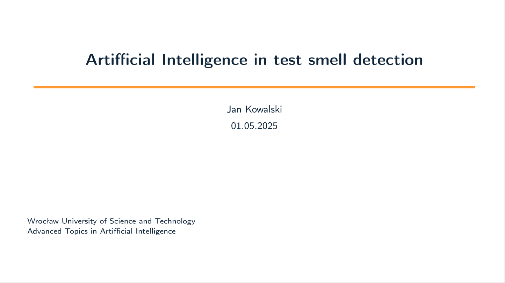
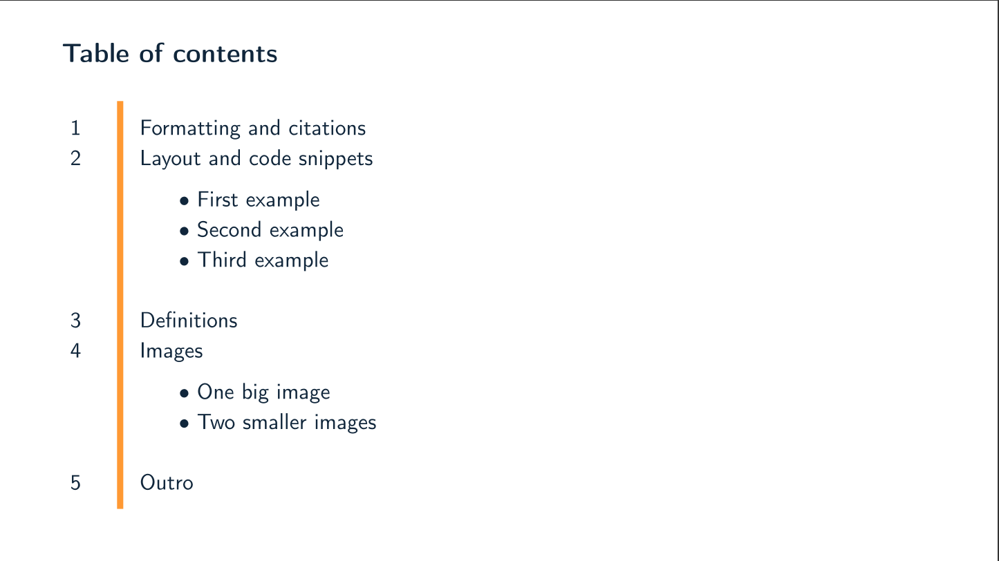
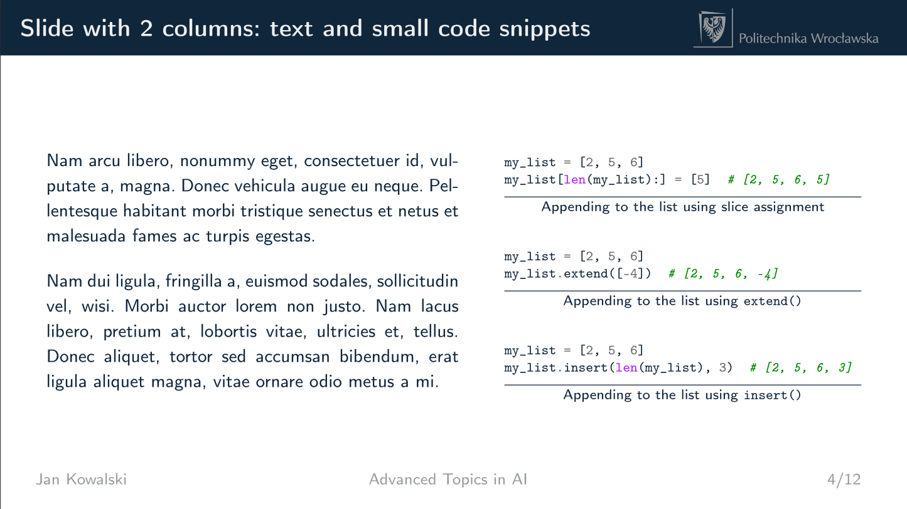
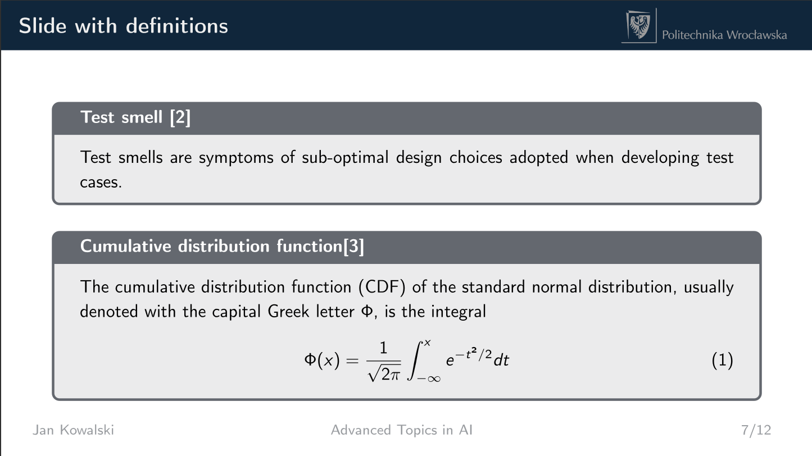
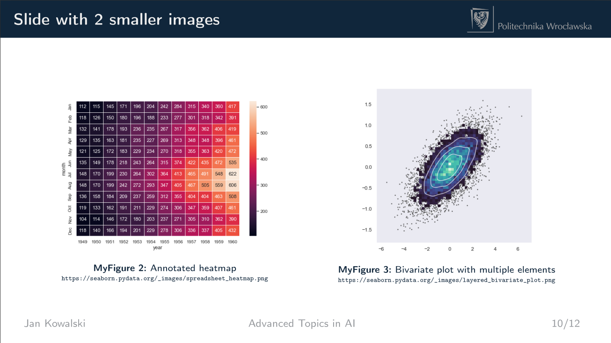
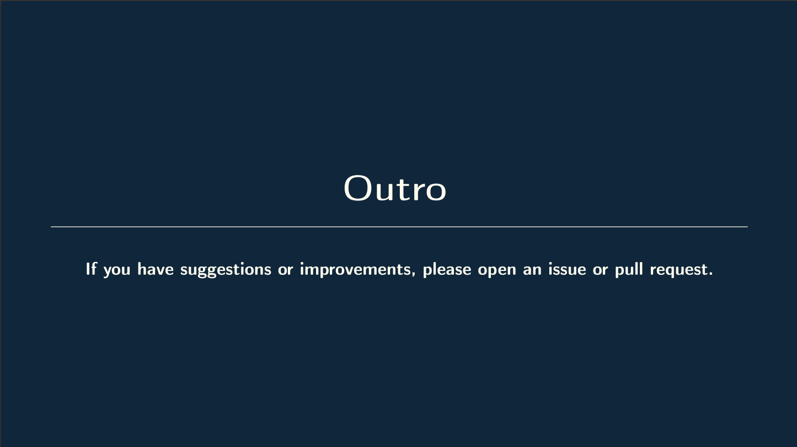

# LaTeX Template for presentations at PWr (WUST)

<!-- BADGES -->
<p align="left">
   <a href="https://github.com/Krisenberg/pwr-presentation-template/blob/main/LICENSE"></a>
   <a href="https://www.repostatus.org/lifecycle"></a>
</p>


## Overview
A simple LaTeX template for presentations at Wrocław University of Science and Technology. It's designed for visual presentations that need professional formatting.


## Attribution
This template is based on the [beamertheme-gotham](https://gitlab.com/RomainNOEL/beamertheme-gotham) created by Romain NOEL. The original work has been sligthly customized - see [beamerthemepwrpresentation.sty](https://github.com/Krisenberg/pwr-presentation-template/blob/main/beamerthemepwrpresentation.sty).


## Preview
<p align="center">
  
  
</p>
<p align="center">
  
  
</p>
<p align="center">
  
  
</p>


## 🔧 Setup

### 1. Prerequisites
You'll need a LaTeX distribution installed:
- [TeX Live](https://www.tug.org/texlive/) (cross-platform)
- [MiKTeX](https://miktex.org/) (Windows)
- [MacTeX](https://www.tug.org/mactex/) (macOS)

### 2. Compilation
Compile using your preferred LaTeX editor (Overleaf, TeXworks, VS Code with LaTeX Workshop):
```sh
pdflatex report.tex   # or use a LaTeX editor's build button
```

### 3. Customization


## Contributing
Contributions are welcome! If you have suggestions or improvements, please open an issue or pull request.


## License  
This template is released under the **LaTeX Project Public License, version 1.3c (LPPL1.3c)** - see the [LICENSE](LICENSE) file for details.
